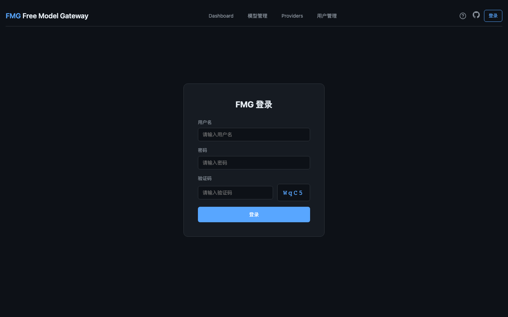
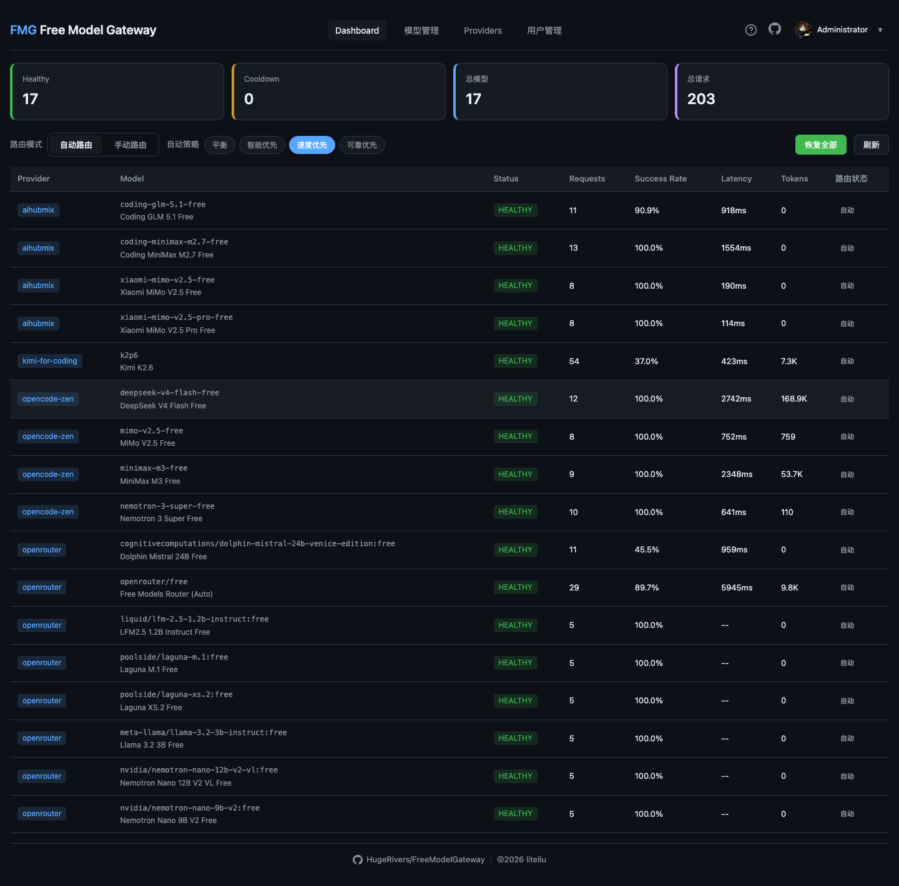
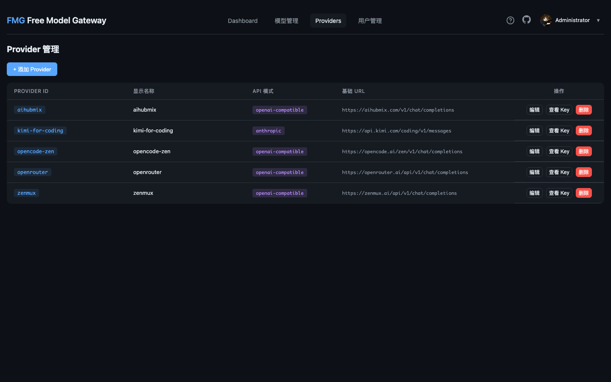
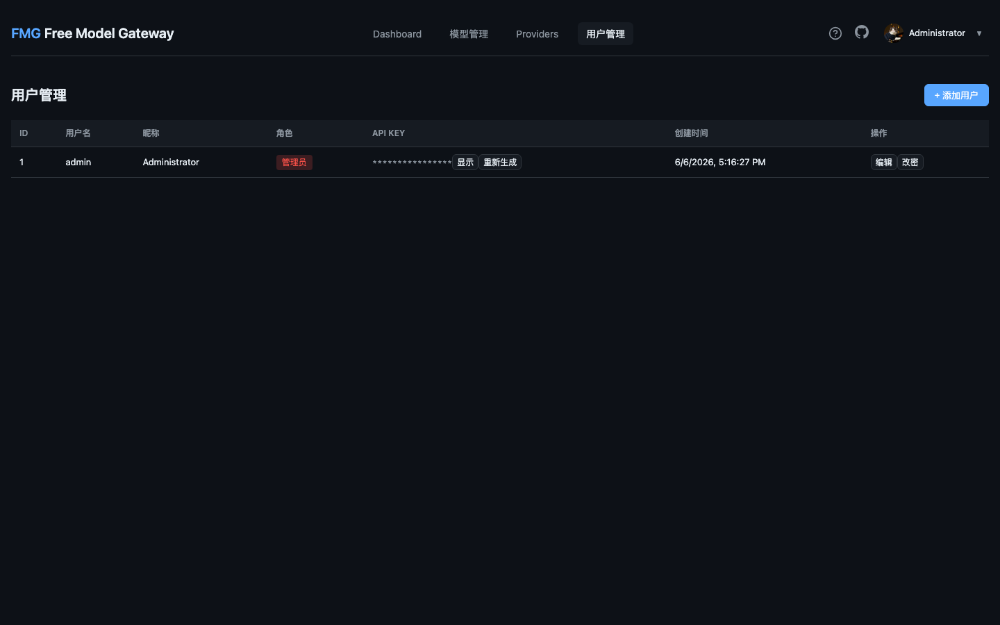
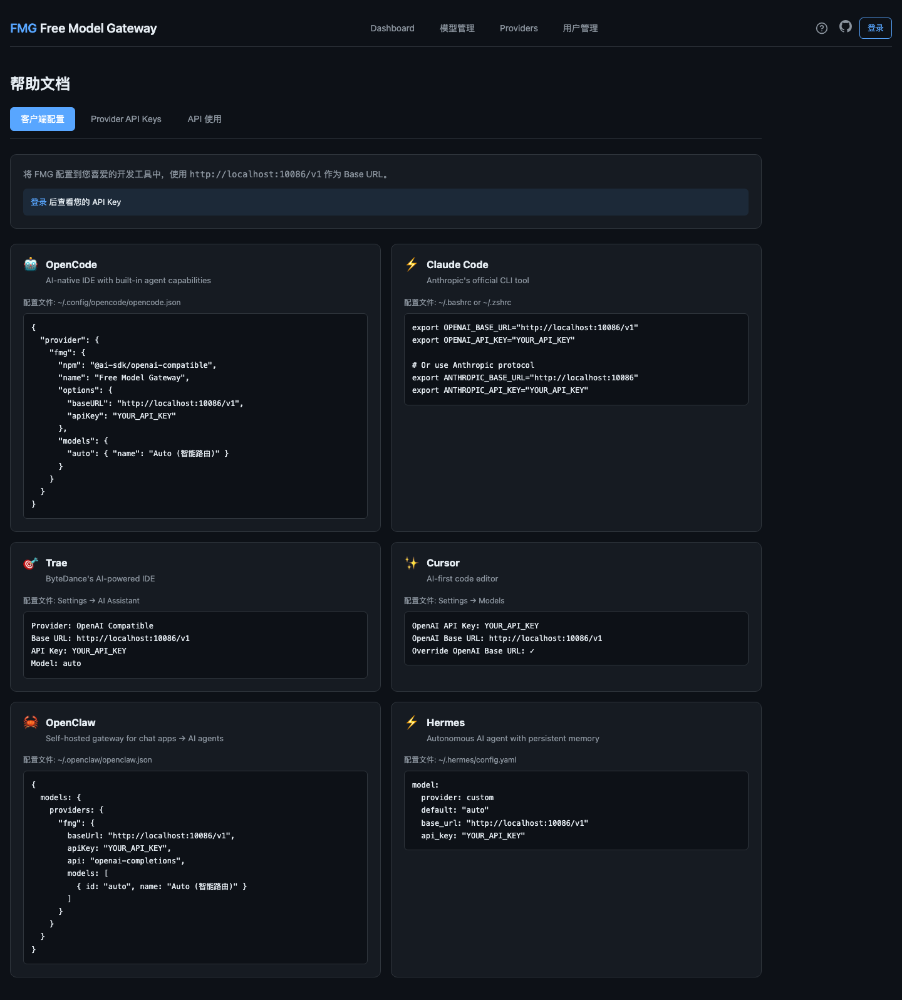

# Free Model Gateway (FMG)

> 统一代理多个免费 AI 模型 Provider 的智能网关
> **OpenAI 兼容 API** · **智能路由** · **自动故障转移** · **多用户管理**
> Single binary · Zero dependencies · 自托管

**GitHub**: [HugeRivers/FreeModelGateway](https://github.com/HugeRivers/FreeModelGateway) | **监听端口**: `10086`

---

## ✨ 功能特性

### 1. 多用户认证与权限管理

- 支持多用户登录，默认管理员账号 `admin/admin`
- 角色分级：管理员（全权限）vs 普通用户（仅浏览）
- 每个用户独立的 API Key，用于第三方工具接入
- 用户资料管理（头像、昵称、密码修改）

### 2. 多 Provider 智能路由

- 支持 OpenCode Zen、OpenRouter、AIHubMix、ZenMux 等平台
- 支持添加自定义 Provider（任何 OpenAI 兼容平台）
- 4 种路由策略：平衡模式、智能优先、速度优先、可靠优先
- 自动故障转移：单个模型失败时自动切换到备用模型
- 模型冷却机制：429/5xx 错误后自动暂时禁用，逐步自动恢复

### 3. Web 管理后台

- 实时 Dashboard：模型健康状态、请求统计、Token 用量
- Provider 管理：配置 API Key、启用/禁用模型
- 模型管理：查看、添加、编辑模型
- 用户管理：创建用户、分配权限、API Key 管理
- 帮助中心：集成指南、API 使用示例

### 4. 多协议支持

- **OpenAI Chat Completions** - `POST /v1/chat/completions`
- **OpenAI Responses** - `POST /v1/responses`
- **Anthropic Messages** - `POST /v1/messages`
- **Google Gemini** - `POST /v1/models/:model/generateContent`
- **Amazon Bedrock** - `POST /model/:modelId/converse`

### 5. 安全与可观测

- API Key AES 加密存储
- JWT 令牌 + Cookie 双重认证
- 结构化日志，支持按字段过滤
- 实时报表：成功率、延迟、Token 用量

---

## 📸 界面预览

### 登录页面

登录后进入 Dashboard，默认管理员账号为 `admin`，密码为 `admin`。



### Dashboard 仪表盘

实时展示所有模型状态、请求统计和路由策略。支持自动刷新。



### Provider 管理

配置各平台 API Key，支持内置模板和自定义 Provider。



### 用户管理

管理员可以创建用户、分配角色、管理 API Key。



### 帮助中心

查看常见开发工具的集成配置方法。



---

## 🚀 快速开始

### 快速启动

```bash
# 构建并启动
make build
./bin/fmg

# 或使用调试模式
./bin/fmg --log-level debug
```

启动后访问 `http://localhost:10086`，使用 `admin/admin` 登录。

### 配置数据目录

所有数据存储在用户目录 `~/.fmg/` 下：

```
~/.fmg/
├── data.db          # SQLite 数据库（配置、统计、API Key）
├── logs/
│   └── fmg-2024-01-01.log  # 日志文件
└── fmg.pid              # 进程 PID
```

---

## 🔧 配置 Provider

### 添加内置 Provider

1. 登录后台，点击顶部 "Providers" 导航
2. 点击 "+ 添加 Provider" 按钮
3. 选择已支持的平台模板：
    - **OpenCode Zen** - `https://opencode.ai/auth`
    - **OpenRouter** - `https://openrouter.ai/models`
    - **AIHubMix** - `https://console.aihubmix.com/token`
    - **ZenMux** - `https://zenmux.ai/platform/pay-as-you-go`
4. 填写 API Key（从对应平台获取）
5. 点击保存，立即生效

### 添加自定义 Provider

1. 在添加 Provider 弹窗中选择 "Custom (自定义)"
2. 填写以下信息：
    - **提供商 ID**：唯一标识，如 `my-provider`
    - **显示名称**：人可读的名称
    - **API 模式**：选择对应的协议格式
    - **基础 URL**：API 基础地址，如 `https://api.example.com/v1`
    - **API 密钥**：对应平台的 API Key
3. 保存后即可使用

### 支持的 API 格式

| API 格式                  | 描述               | 示例 Base URL                                       |
|-------------------------|------------------|---------------------------------------------------|
| OpenAI Chat Completions | 标准 OpenAI 对话 API | `https://api.openai.com/v1`                       |
| OpenAI Responses        | OpenAI 响应 API    | `https://api.openai.com/v1`                       |
| Anthropic Messages      | Claude 消息 API    | `https://api.anthropic.com`                       |
| Google Gemini           | Gemini 生成 API    | `https://generativelanguage.googleapis.com`       |
| Amazon Bedrock          | AWS Bedrock API  | `https://bedrock-runtime.us-east-1.amazonaws.com` |

---

## 🖼️ 配置模型

### 查看模型

在 Dashboard 页面可以看到所有已配置的模型列表，包括：

- Provider 名称
- 模型 ID 和名称
- 状态（Healthy / Cooldown / Exhausted）
- 累计请求数、成功率、平均延迟
- Token 用量统计

### 路由策略切换

顶部工具栏支持实时切换路由策略：

- **平衡模式** (默认)：可靠性、速度、智能性综合考量
- **智能优先**：优先选择能力最强的模型
- **速度优先**：优先选择响应最快的模型
- **可靠优先**：优先选择最稳定的模型

### 手动选择模型

也可以手动锁定特定模型，跳过自动路由：

1. 点击 "手动路由" 模式
2. 选择 Provider
3. 选择具体模型
4. 点击 "确定"

---

## 🔧 第三方工具集成

FMG 提供标准 OpenAI 兼容 API，可以接入几乎所有支持自定义 OpenAI API 的工具。

**基础配置信息**：

- **Base URL**: `http://localhost:10086/v1`（或你的实际服务地址）
- **API Key**: 在 FMG 后台 "用户管理" 页面获取个人 API Key
- **模型**: `auto` (触发智能路由)

### OpenCode

编辑配置文件 `~/.config/opencode/opencode.json`：

```json
{
  "provider": {
    "fmg": {
      "npm": "@ai-sdk/openai-compatible",
      "name": "Free Model Gateway",
      "options": {
        "baseURL": "http://localhost:10086/v1",
        "apiKey": "你的API_KEY"
      },
      "models": {
        "auto": { "name": "Auto (智能路由)" }
      }
    }
  }
}
```

### Claude Code

设置环境变量：

```bash
# 方式一：使用 OpenAI 兼容模式
export OPENAI_BASE_URL="http://localhost:10086/v1"
export OPENAI_API_KEY="你的API_KEY"

# 方式二：使用 Anthropic 协议
export ANTHROPIC_BASE_URL="http://localhost:10086"
export ANTHROPIC_API_KEY="你的API_KEY"
```

### Cursor

1. 打开 Cursor Settings
2. 转到 Models 页面
3. 填写：
    - OpenAI API Key: `你的API_KEY`
    - OpenAI Base URL: `http://localhost:10086/v1`
4. 勾选 "Override OpenAI Base URL"

### Trae

1. 打开 Settings → AI Assistant
2. 选择 Provider 为 "OpenAI Compatible"
3. 填写：
    - Base URL: `http://localhost:10086/v1`
    - API Key: `你的API_KEY`
    - Model: `auto`

### OpenClaw

编辑 `~/.openclaw/openclaw.json`：

```json
{
  "models": {
    "providers": {
      "fmg": {
        "baseUrl": "http://localhost:10086/v1",
        "apiKey": "你的API_KEY",
        "api": "openai-completions",
        "models": [
          { "id": "auto", "name": "Auto (智能路由)" }
        ]
      }
    }
  }
}
```

### Hermes

编辑 `~/.hermes/config.yaml`：

```yaml
model:
  provider: custom
  default: "auto"
  base_url: "http://localhost:10086/v1"
  api_key: "你的API_KEY"
```

### 直接使用 curl

```bash
# 非流式请求
curl -X POST http://localhost:10086/v1/chat/completions \
  -H "Content-Type: application/json" \
  -H "Authorization: Bearer 你的API_KEY" \
  -d '{
    "model": "auto",
    "messages": [{"role": "user", "content": "Hello!"}]
  }'

# 流式请求
curl -X POST http://localhost:10086/v1/chat/completions \
  -H "Content-Type: application/json" \
  -H "Authorization: Bearer 你的API_KEY" \
  -d '{
    "model": "auto",
    "messages": [{"role": "user", "content": "Hello!"}],
    "stream": true
  }'
```

---

## 💾 打包发布

### macOS

#### 系统要求

- **macOS 10.13 (High Sierra)** 或更高版本
- **Apple Silicon (M1/M2/M3)** 或 **Intel Mac** 均可

#### 安装方式

**方式一：安装包（推荐）**

```bash
# 构建并打包
make package-darwin

# 产物
# - dist/fmg-1.0.0-macos.pkg    # 安装包（安装 CLI 到 /usr/local/bin）
# - dist/fmg-1.0.0-macos.dmg    # 磁盘映像（含 Free Model Gateway.app）
```

安装后使用：

```bash
# 从终端启动
fmg

# 或打开 Applications 中的 Free Model Gateway.app
```

**方式二：直接运行**

```bash
make build
./bin/fmg
```

#### Gatekeeper 提示无法打开？

由于应用未经过 Apple 签名，首次运行时 macOS 会阻止打开。

**解决方法**：

1. **pkg 安装器**：按住 `Control` 键点击 `.pkg` 文件，选择「打开」
2. **.app 应用**：
   ```bash
   # 移除应用上的隔离属性
   xattr -dr com.apple.quarantine "/Applications/Free Model Gateway.app"
   
   # 然后正常打开
   open "/Applications/Free Model Gateway.app"
   ```
3. **通用设置**（macOS 13+）：系统设置 → 隐私与安全性 → 安全性 → 点击「仍要打开」

#### macOS App 功能

- 状态栏图标显示运行状态
- 一键打开 Dashboard
- 启动/停止/重启服务
- 自动初始化 `~/.fmg/` 目录

### Windows

#### 方式一：直接下载（推荐）

从 [GitHub Releases](https://github.com/HugeRivers/FreeModelGateway/releases) 下载 Windows 版本：

- `fmg-windows-amd64.zip` — 包含托盘应用 + 主程序 + 启动脚本

解压后双击 `fmg-tray.exe` 即可启动，系统托盘会出现 FMG 图标。

#### 方式二：自行构建

在 Windows 上构建：

```powershell
# 构建主程序
go build -o fmg.exe ./cmd/fmg/

# 构建托盘应用（需要 mingw-w64）
go build -o fmg-tray.exe ./cmd/tray/

# 创建启动脚本
echo "@echo off" > start.bat
echo "cd /d "%~dp0"" >> start.bat
echo "start "" "fmg-tray.exe"" >> start.bat
```

**托盘应用功能**：

- 系统托盘图标显示运行状态
- 右键菜单：打开 Dashboard / 启动服务 / 停止服务 / 重启服务 / 退出
- 自动初始化 `%USERPROFILE%\.fmg\` 目录

#### 方式三：在 macOS/Linux 上交叉编译

```bash
# 安装 mingw-w64（macOS）
brew install mingw-w64

# 构建 Windows 托盘应用
make build-tray-windows

# 打包
make package-windows
```

### Linux

```bash
# 当前平台构建
make build-linux

# 或所有平台交叉编译
make build-all

# 产物
# - dist/fmg-1.0.0-linux-amd64
# - dist/fmg-1.0.0-linux-arm64
```

安装到系统路径：
```bash
# 安装到 /usr/local/bin
sudo cp dist/fmg-1.0.0-linux-amd64 /usr/local/bin/fmg
sudo chmod +x /usr/local/bin/fmg

# 启动服务
fmg --port 10086
```

### Docker

```bash
# 构建镜像
make docker

# 运行容器
make docker-run

# 或手动运行
docker run -d -p 10086:10086 -v ~/.fmg:/root/.fmg fmg:latest
```

### 通用构建命令

```bash
# 当前平台
make build

# 特定平台
make build-darwin    # macOS
make build-linux     # Linux
make build-windows   # Windows

# 全平台
make build-all

# 运行测试
make test

# 查看帮助
make help
```

---

## 🌐 Provider API Key 获取指南

| Provider     | 获取地址                                     |
|--------------|------------------------------------------|
| OpenCode Zen | https://opencode.ai/auth                 |
| OpenRouter   | https://openrouter.ai/models             |
| AIHubMix     | https://console.aihubmix.com/token       |
| ZenMux       | https://zenmux.ai/platform/pay-as-you-go |

---

## 📖 开源协议

本项目采用 **MIT** 协议开源。

欢迎提交 Issue 和 Pull Request！

**GitHub**: [https://github.com/HugeRivers/FreeModelGateway](https://github.com/HugeRivers/FreeModelGateway)

---

## ⚠️ 常见问题

| 问题              | 解决方案                                            |
|-----------------|-------------------------------------------------|
| 端口 10086 被占用    | `./bin/fmg --port 10087` 换端口                    |
| 登录失败            | 默认账号密码为 `admin/admin`                           |
| API Key 未设置     | 进入 Providers 页面配置各平台 Key                        |
| 模型全部进入 cooldown | 点击 "恢复全部" 按钮或等待自动恢复                             |
| 第三方工具连接失败       | 检查 Base URL 和 API Key 是否正确                      |
| 日志查看            | `tail -f ~/.fmg/logs/fmg-$(date +%Y-%m-%d).log` |

---

由 [HugeRivers](https://github.com/HugeRivers) 开发 © 2026
