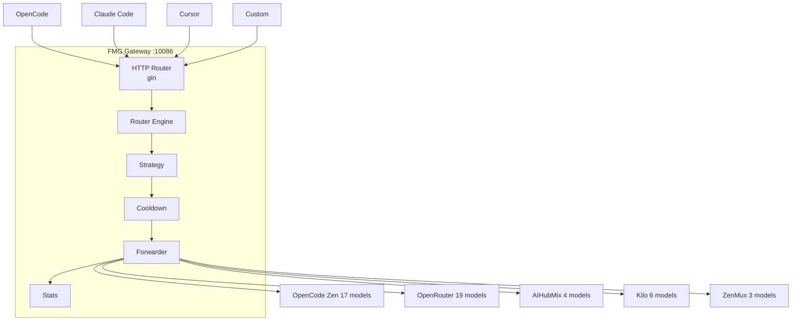

# Free Model Gateway (FMG)

> 统一代理多个免费 AI 模型 Provider 的智能网关，**OpenAI 兼容 API** · **自动故障转移** · **配额轮转** · **健康监测**
> Single binary · Zero external dependencies · Hot reload

**监听端口 / Port: `10086`**

---

## 项目简介 (Overview)

**Free Model Gateway (FMG)** 是一个自托管的 AI 模型智能网关。它在 OpenCode Zen、OpenRouter、AIHubMix、Kilo Gateway、ZenMux 等多家免费模型 Provider 之上，提供：

- **统一入口**：标准 OpenAI `/v1/chat/completions` 端点
- **自动路由**：按优先级 / 轮询 / 加权 / 随机 4 种策略
- **故障转移**：429 / 5xx 自动切换下一个模型
- **冷却恢复**：指数退避冷却 + 定时自动恢复
- **可观测性**：结构化 JSON 日志 + 实时统计 + 管理 API

---

## 特性 (Features)

| 编号 | 能力 |
|------|------|
| FR-01 | 兼容 OpenAI Chat Completions API（非流式 + SSE 流式） |
| FR-02 | 多 Provider 后端池，配置文件驱动，**无需改代码** |
| FR-03 | 4 种路由策略：priority / round-robin / weighted-rr / random |
| FR-04 | 自动故障转移，429/5xx/超时触发重试，4xx 直接返回 |
| FR-05 | 模型冷却 + 指数退避 + 自动恢复（5min → 1h） |
| FR-06 | 用量追踪：tokens、成功率、平均延迟、错误计数 |
| FR-07 | 管理 API：recover / reload / providers |
| FR-08 | YAML 配置 + 环境变量注入 API Key + SIGHUP 热重载 |

---

## 架构 (Architecture)



---

## 快速开始 (Quick Start)

### 1. 构建二进制

```bash
make build              # 当前平台
make build-all          # 全平台交叉编译
make package-darwin     # macOS .pkg + .dmg (含状态栏图标)
```

### 2. 准备配置

所有配置文件自动存放在用户目录 `~/.fmg/` 下：

```
~/.fmg/
├── config.yaml          # 网关配置
├── .env                 # API Keys
├── data.db              # SQLite 持久化数据
├── logs/
│   └── fmg-YYYY-MM-DD.log   # 日志文件（自动滚动，保留最近一天）
└── fmg.pid              # 进程 PID
```

首次运行会自动创建目录和模板文件：

```bash
./bin/fmg               # 自动初始化 ~/.fmg/ 目录
# 或
make run                # 构建并启动
```

手动准备：
```bash
mkdir -p ~/.fmg
cp config.example.yaml ~/.fmg/config.yaml
cp .env.example ~/.fmg/.env
vim ~/.fmg/.env         # 填入 API Key
```

### 3. 启动

**macOS App（推荐）**
- 安装 `.dmg` 中的 `Free Model Gateway.app` 到 Applications
- 双击启动，状态栏显示图标
- 点击图标可：打开 Dashboard / 启动服务 / 停止服务 / 重启服务 / 退出

**CLI**
```bash
./start.sh              # macOS / Linux
# 或
./bin/fmg               # 直接启动（使用 ~/.fmg/config.yaml）
```

启动后自动打开 `http://localhost:10086/`。

---

## 配置说明 (Configuration)

配置文件默认读取 `~/.fmg/config.yaml`，可用 `-c` 指定其他路径。

完整配置模板见 [`config.example.yaml`](./config.example.yaml)。

```yaml
gateway:
  host: "0.0.0.0"
  port: 10086                  # 监听端口
  max_retries: 3               # 单次请求最大重试次数
  retry_delay_ms: 500          # 重试间隔
  connect_timeout_s: 60        # 连接超时
  read_timeout_s: 120          # 读取超时（流式设 0 = 无限等待）

strategy:
  mode: "priority"             # priority | round-robin | weighted-rr | random
  cooldown_seconds: 300        # 基础冷却时间（5min）
  max_cooldown_s: 3600         # 最大冷却时间（1h）

log:
  level: "info"                # debug | info | warn | error
  format: "json"               # json | text

providers:
  - id: opencode-zen
    name: "OpenCode Zen"
    base_url: "https://opencode.ai/zen/v1/chat/completions"
    api_key_env: "OPENCODE_API_KEY"   # 从环境变量读取
    priority: 10                      # 数字越小优先级越高
    weight: 10                        # 加权轮询的权重
    models:
      - id: deepseek-v4-flash-free
        context_window: 128000
        output_limit: 128000
```

**注意**：API Key 绝不能写入 YAML，必须通过环境变量注入。

---

## 支持的 Provider 与模型 (Providers)

| Provider | 模型数 | 优先级 | 备注 |
|----------|--------|--------|------|
| OpenCode Zen | 17 | 10 (P0) | 默认首选 |
| OpenRouter | 19 | 20 (P1) | 模型最丰富 |
| AIHubMix | 4 | 30 (P2) | 编程模型强 |
| Kilo Gateway | 6 | 40 (P3) | 自动路由 |
| ZenMux | 3 | 50 (P4) | 备用 |
| **合计** | **49** | | |

---

## 路由策略 (Strategies)

| 策略 | 行为 | 适用场景 |
|------|------|----------|
| `priority` | 按 `priority` 升序尝试，第一个可用即用 | 生产推荐 |
| `round-robin` | 在所有可用模型间循环 | 均摊负载 |
| `weighted-rr` | 平滑加权轮询 (Nginx-style) | 精细控制流量比例 |
| `random` | 随机选择 | 测试/压测 |

切换策略：修改 `strategy.mode` 后 `kill -HUP <pid>` 或 `curl -X POST http://localhost:10086/admin/reload`。

---

## API 文档 (API Reference)

### `POST /v1/chat/completions`

OpenAI 兼容请求：

```bash
curl -X POST http://localhost:10086/v1/chat/completions \
  -H "Content-Type: application/json" \
  -d '{
    "model": "auto",
    "messages": [{"role": "user", "content": "Hello!"}],
    "stream": false
  }'
```

非流式响应（注入 `metadata` 字段）：

```json
{
  "id": "chatcmpl-xxx",
  "model": "deepseek-v4-flash-free",
  "choices": [{"message": {"role": "assistant", "content": "Hi!"}}],
  "usage": {"prompt_tokens": 10, "completion_tokens": 5, "total_tokens": 15},
  "metadata": {
    "gateway": "FreeModelGateway",
    "version": "1.0.0",
    "actual_provider": "OpenCode Zen",
    "actual_model_id": "deepseek-v4-flash-free",
    "fallback_count": 0,
    "fallback_chain": [],
    "route_strategy": "priority",
    "latency_ms": 1234
  }
}
```

`"model": "auto"` 触发自动路由；指定具体 model_id 则锁定该模型。

流式：设置 `"stream": true`，响应为 `text/event-stream` 透传。

### `GET /v1/models`

```bash
curl http://localhost:10086/v1/models
```

返回 OpenAI 兼容格式，每个模型带 `status`、`priority`、`statistics` 字段。

### `GET /health`

```bash
curl http://localhost:10086/health
# {"status":"ok","uptime_seconds":3600,"version":"1.0.0","models_total":49,"healthy":47,"cooldown":2}
```

### `GET /stats`

```bash
curl http://localhost:10086/stats
```

返回所有模型的完整统计（成功/失败/输入输出 tokens/平均延迟/成功率）。

### `POST /admin/recover`

```bash
# 恢复全部冷却中的模型
curl -X POST http://localhost:10086/admin/recover -d '{}' -H "Content-Type: application/json"

# 恢复指定模型
curl -X POST http://localhost:10086/admin/recover \
  -d '{"provider_id":"opencode-zen","model_id":"deepseek-v4-flash-free"}' \
  -H "Content-Type: application/json"
```

### `POST /admin/reload`

```bash
curl -X POST http://localhost:10086/admin/reload
# {"reloaded":true,"providers":5,"port":10086,"mode":"priority"}
```

也支持 `kill -HUP <pid>` 触发 SIGHUP 重载。

### `GET /admin/providers`

```bash
curl http://localhost:10086/admin/providers
# {"providers":[{"provider_id":"opencode-zen","total":17,"healthy":17,"cooldown":0,...}]}
```

---

## 客户端接入 (Client Integration)

### OpenCode

```jsonc
// ~/.config/opencode/opencode.json
{
  "provider": {
    "fmg": {
      "npm": "@ai-sdk/openai-compatible",
      "name": "Free Model Gateway",
      "options": {
        "baseURL": "http://localhost:10086/v1",
        "apiKey": "fmg-local"
      },
      "models": {
        "auto": { "name": "Auto (智能路由)" }
      }
    }
  }
}
```

### Claude Code

```bash
export ANTHROPIC_BASE_URL="http://localhost:10086"
export ANTHROPIC_API_KEY="fmg-local"
```

或 OpenAI 兼容模式：

```bash
export OPENAI_BASE_URL="http://localhost:10086/v1"
export OPENAI_API_KEY="fmg-local"
```

### Cursor

Settings → Models:
- OpenAI API Key: `fmg-local`
- OpenAI Base URL: `http://localhost:10086/v1`

---

## 命令行参数 (CLI)

```bash
fmg                                # 默认启动（自动使用 ~/.fmg/config.yaml）
fmg --list-models                 # 列出已配置模型
fmg --validate-config             # 校验配置
fmg --port 10086                  # 覆盖监听端口
fmg --log-level debug             # 调试日志
fmg --version                     # 打印版本
```

完整参数见 `fmg --help`。

---

## 构建与发布 (Build & Distribute)

### CLI 二进制

```bash
make build              # 当前平台
make build-all          # 交叉编译 linux/darwin/windows
make install            # 安装到 /usr/local/bin
```

### macOS App（含状态栏图标）

```bash
make build-tray         # 构建状态栏应用
make package-darwin     # 构建 .pkg + .dmg
```

产物：
- `dist/fmg-*-macos.pkg` — 安装包（安装 CLI 到 /usr/local/bin）
- `dist/fmg-*-macos.dmg` — 磁盘映像（含 Free Model Gateway.app）

App 功能：
- 状态栏图标（🟢 运行中 / ⚪ 已停止）
- 点击图标打开 Dashboard
- 启动 / 停止 / 重启 服务
- 自动初始化 `~/.fmg/` 目录

### Docker

```bash
make docker             # Docker 镜像
make docker-run         # 启动容器（端口 10086）
```

---

## 故障排查 (Troubleshooting)

| 问题 | 解决方案 |
|------|----------|
| 端口 10086 被占用 | `lsof -i :10086` 找到占用进程；或 `fmg --port 10087` |
| API Key 未设置 | 检查 `~/.fmg/.env` 文件，填入 `XXX_API_KEY=...` |
| 大量模型进入 cooldown | 等待 5min 自动恢复；或 `POST /admin/recover` 立即恢复 |
| 流式无响应 | 检查上游是否支持 SSE；`read_timeout_s: 0` 设为无限等待 |
| Config 格式错误 | `fmg --validate-config` 看具体错误 |
| 启动失败 | `tail -f ~/.fmg/logs/fmg-$(date +%Y-%m-%d).log` 查看结构化日志 |
| 切换路由策略 | 修改 `config.yaml` 的 `strategy.mode`，然后 `kill -HUP <pid>` |

---

## 开发 (Development)

### 1. 环境准备 (Prerequisites)

| 工具 | 最低版本 | 用途 | 安装 |
|------|---------|------|------|
| **Go** | 1.22+ | 编译与运行 | https://go.dev/dl/ |
| **Git** | 2.x | 版本管理 | `brew install git` / 系统包管理器 |
| **Make** | 任意 | 包装构建命令 | macOS: `xcode-select --install`；Linux: `apt install build-essential` |
| **curl** | 任意 | 测试 API | 系统自带 |
| **jq** *(可选)* | 任意 | 美化 JSON 输出 | `brew install jq` |

**验证环境**：

```bash
go version       # go version go1.22+ darwin/arm64
git --version
make --version
```

**首次拉取依赖**：

```bash
go mod download
go mod verify    # 校验 go.sum 完整性
```

---

### 2. 推荐 IDE

#### A. GoLand (JetBrains) — 推荐

1. **打开项目**：`File` → `Open` → 选择项目根目录（包含 `go.mod` 的目录）
2. **配置 SDK**：`File` → `Project Structure` → `Project` → `SDK` 选 `go1.22+`
3. **启用 Go Mod**：`Settings` → `Go` → `Go Modules` → 勾选 `Enable Go modules integration`
4. **安装插件**（可选但推荐）：
   - `EnvFile` — 自动加载 `.env` 到 Run Configuration
   - `String Manipulation`
   - `.env files support`

**创建 Run Configuration**：

1. 右上角 `Add Configuration` → `+` → `Go Build`
2. 配置：
   - **Run kind**: `Package`
   - **Package path**: `github.com/free-model-gateway/fmg/cmd/fmg`
   - **Working directory**: 项目根目录
   - **Environment**: 通过 EnvFile 插件加载 `.env`，或在 `Environment variables` 直接填
3. **Program arguments**（可选）：`-l debug`
4. 点击 ▶ 即可运行；点击 🐞 即可断点调试

**调试 GoLand**：

- 在代码行号左侧单击设置断点
- `Debug` 启动后程序在断点处停下
- `F8` 单步跳过，`F7` 单步进入，`Shift+F8` 跳出，`F9` 继续
- 调试控制台可用 `goroutine` 查看、`Evaluate Expression` 实时计算

**调试 Delve（attach 到运行中的进程）**：

```bash
# 1. 启动 fmg（不带 -s -w 以保留符号表，便于调试）
go build -o bin/fmg ./cmd/fmg/
./bin/fmg -l debug

# 2. 找到 PID
pgrep fmg

# 3. 在 GoLand 中：Run → Attach to Process → 选 fmg
```

#### B. VSCode

1. 安装扩展：`Go` (Google 官方)，`YAML`，`Even Better TOML`
2. 项目根目录创建 `.vscode/settings.json`：

```json
{
  "go.useLanguageServer": true,
  "go.lintTool": "golangci-lint",
  "go.formatTool": "goimports",
  "editor.formatOnSave": true,
  "go.testFlags": ["-race", "-count=1"]
}
```

3. 创建 `.vscode/launch.json`（F5 启动）：

```jsonc
{
  "version": "0.2.0",
  "configurations": [
    {
      "name": "Launch fmg",
      "type": "go",
      "request": "launch",
      "mode": "auto",
      "program": "${workspaceFolder}/cmd/fmg",
      "args": ["-l", "debug"],
      "envFile": "${env:HOME}/.fmg/.env"
    },
    {
      "name": "Attach to fmg",
      "type": "go",
      "request": "attach",
      "mode": "local",
      "processId": "${command:pickProcess}"
    }
  ]
}
```

4. F5 启动；侧栏 `Run and Debug` 可断点调试

#### C. Vim / Neovim

```lua
-- init.lua: 配置 gopls + nvim-dap
require('lspconfig').gopls.setup{ ... }
-- 调试用 nvim-dap + delve：
-- :DapNewDebugSession go
```

---

### 3. 常用开发命令 (Workflow)

```bash
# 构建
make build                       # 当前平台
make build-linux                 # linux/amd64

# 跑测试（带 race detector）
make test

# 测试覆盖率
make test-coverage
open coverage.html               # macOS 浏览器打开

# Lint（需先 go install github.com/golangci/golangci-lint/cmd/golangci-lint@latest）
make lint

# 本地开发（debug 日志 + 热重载）
make dev

# 跑单个测试
go test -v -run TestPriorityStrategy ./internal/router/

# 跑某个包的测试
go test -v -race ./internal/cooldown/

# 基准测试
go test -bench=. ./internal/router/
```

**热重载配置**（不重启进程）：

```bash
# 方法 1: SIGHUP
kill -HUP $(pgrep fmg)

# 方法 2: HTTP API
curl -X POST http://localhost:10086/admin/reload
```

---

### 4. 调试技巧 (Debugging)

#### A. 结构化日志调试

```bash
# JSON 日志中按字段过滤
tail -f logs/fmg.log | jq 'select(.path=="/v1/chat/completions")'

# 看某个模型的调用历史
tail -f logs/fmg.log | jq 'select(.model=="deepseek-v4-flash-free")'

# 看错误
tail -f logs/fmg.log | jq 'select(.status>=400)'
```

#### B. Delve 命令行调试

```bash
# 安装
go install github.com/go-delve/delve/cmd/dlv@latest

# 调试 main
dlv debug ./cmd/fmg/

# 附加到运行中进程
dlv attach $(pgrep fmg)

# 常用命令
(dlv) break main.main
(dlv) break internal/router/fallback.go:30
(dlv) continue
(dlv) next
(dlv) step
(dlv) print r.pool
(dlv) locals
(dlv) goroutines
(dlv) quit
```

#### C. pprof 性能分析

启动时如需 pprof，临时在 main.go 加一行：

```go
import _ "net/http/pprof"
// go http.ListenAndServe("localhost:6060", nil)
```

采集 CPU profile：

```bash
go tool pprof http://localhost:6060/debug/pprof/profile?seconds=30
```

采集内存：

```bash
go tool pprof http://localhost:6060/debug/pprof/heap
```

#### D. 模拟上游行为（不用真 API Key）

用 `httptest` 或写一个 mock upstream 测 fallback 逻辑：

```go
// 临时把 config.example.yaml 里的 base_url 指向 http://localhost:9999
// 跑一个 python -m http.server 9999 看转发是否成功
```

---

### 5. 项目结构（贡献者必读）

```
fmg/
├── cmd/fmg/main.go                 入口；wire 所有依赖；启动 HTTP server
├── internal/
│   ├── config/                     YAML 加载、校验、SIGHUP 重载
│   ├── model/                      BackendModel 状态机 + Pool
│   ├── cooldown/                   指数退避冷却
│   ├── stats/                      统计快照
│   ├── proxy/                      HTTP 转发 + SSE 流式
│   ├── router/                     4 种路由策略 + 故障转移循环
│   ├── handler/                    Gin handlers
│   └── middleware/                 logging / recovery / cors
└── doc/REQUIREMENTS.md             完整需求与架构
```

**包依赖图（无环）**：

```
config ───┐
          ↓
model ←─ (无依赖)
  ↑
cooldown ──┐
stats ─────┤
proxy ─────┤
router ────┤
handler ───┴──→ middleware
```

**核心数据流**：

```
HTTP Request
   ↓
gin handler (handler/chat.go)
   ↓
router.Route (router/fallback.go)   ← 核心循环
   ├─ strategy.Select (router/{priority|roundrobin|weighted|random}.go)
   ├─ pool.Available (model/pool.go)
   └─ forwarder.Forward (proxy/forwarder.go)
        ├─ 成功 → model.MarkSuccess → stats
        └─ 失败 → cooldownMgr.EnterCooldown (cooldown/manager.go)
```

---

### 6. 代码规范 (Conventions)

- **格式化**：`gofmt -s -w .` 或保存时 IDE 自动执行
- **导入顺序**：`goimports` 自动分组（stdlib / 第三方 / 本项目）
- **命名**：
  - 包名小写单词，无下划线
  - 导出符号用 `PascalCase`，私有用 `camelCase`
  - 错误用 `Err` 前缀：`ErrNoCandidate`
  - 接口用 `-er` 后缀：`Strategy`, `Flusher`
- **错误处理**：
  - 永远不要 `as any` 吞错
  - 永远不要空 `catch`（Go 是 `if err := f(); err != nil { ... }`）
  - 错误要带上下文：`fmt.Errorf("parse config %s: %w", path, err)`
- **并发**：
  - 共享状态必须 mutex 保护
  - 优先 channel，必要时 mutex
  - ctx 永远向下传递
  - 永远不裸 `go func()` 不带 recover
- **日志**：用 logrus 的 WithFields，不直接拼接字符串
- **测试**：每个 exported 函数至少一个 `_test.go`；race detector 必须通过

**提交前自检**：

```bash
make test && make lint && go vet ./...
```

---

### 7. 添加新功能 (Extending)

#### 新增 Provider（不改代码）

只需在 `config.yaml` 追加：

```yaml
providers:
  - id: my-new-provider
    name: "My Provider"
    base_url: "https://api.example.com/v1/chat/completions"
    api_key_env: "MY_API_KEY"
    priority: 60
    models:
      - id: my-model-v1
        name: "My Model v1"
        context_window: 128000
        output_limit: 8192
```

#### 新增路由策略（改代码）

1. 在 `internal/router/` 创建新文件，如 `my_strategy.go`：
   ```go
   package router

   import (
       "context"
       "github.com/free-model-gateway/fmg/internal/model"
   )

   type MyStrategy struct{}

   func (s *MyStrategy) Name() string { return "my-strategy" }
   func (s *MyStrategy) Select(ctx context.Context, candidates []*model.BackendModel, req *Request) (*model.BackendModel, error) {
       // your logic
       return candidates[0], nil
   }
   ```
2. 在 `internal/router/router.go` 的 `SetStrategy()` switch 中加一个 case
3. 在 `internal/config/loader.go` 的 `Validate()` 中加一个允许的 mode
4. 写测试：`internal/router/my_strategy_test.go`

#### 新增 HTTP 端点

1. 在 `internal/handler/` 新建文件，定义 `func (h *Handler) MyEndpoint(c *gin.Context)`
2. 在 `cmd/fmg/main.go` 的 `engine.POST/GET(...)` 注册
3. 更新 `doc/REQUIREMENTS.md` 和本 README

#### 新增中间件

1. 在 `internal/middleware/` 新建文件
2. 返回 `gin.HandlerFunc`
3. 在 `cmd/fmg/main.go` 的 `engine.Use(...)` 链中按顺序插入

---

### 8. 提交流程 (Git Workflow)

```bash
# 1. fork + clone
git clone https://github.com/yourname/free-model-gateway.git
cd free-model-gateway

# 2. 创建分支
git checkout -b feat/add-batching-strategy

# 3. 开发 + 提交（commit message 用 Conventional Commits）
git add .
git commit -m "feat(router): add batching strategy for low-latency scenarios"

# 4. 推送 + 开 PR
git push origin feat/add-batching-strategy
gh pr create --title "feat: add batching strategy" --body "..."
```

**Commit message 规范**（Conventional Commits）：

```
<type>(<scope>): <subject>

<body>

<footer>
```

- `feat` 新功能
- `fix` bug 修复
- `docs` 仅文档
- `refactor` 不改行为的重构
- `perf` 性能优化
- `test` 测试
- `chore` 杂项（构建、依赖、CI）

---

### 9. 常见开发问题 (Dev FAQ)

| 问题 | 解决方案 |
|------|----------|
| `go mod tidy` 卡住 | 设置 `GOPROXY=https://goproxy.cn,direct` |
| GoLand 找不到 SDK | `File → Project Structure → SDKs → + → Go SDK` 选 `go1.22+` |
| 断点不命中 | 确保编译时未加 `-s -w`；用 `go build` 而非 `make build` |
| `make lint` 报找不到 `golangci-lint` | `go install github.com/golangci/golangci-lint/cmd/golangci-lint@latest` |
| 测试偶尔失败 | 加 `-race`；八成是并发 bug |
| 编译报 `import cycle` | 检查 `internal/` 包图，重构时遵守依赖方向 |
| 想本地跑 e2e 但没 API Key | 把 base_url 改成 httpbin.org 或自己的 mock server |

---

### 10. 工具链版本固定

```bash
# go.mod 已固定
go 1.22

# 推荐使用
golangci-lint v1.59+
delve v1.23+
```

---

## 许可证 (License)

MIT

---

## 致谢 (Credits)

- [OpenCode Zen](https://opencode.ai) — free models
- [OpenRouter](https://openrouter.ai) — free models
- [AIHubMix](https://aihubmix.com) — free models
- [Kilo Gateway](https://kilo.ai) — free models
- [ZenMux](https://zenmux.ai) — free models
- [Gin](https://gin-gonic.com) — HTTP framework
