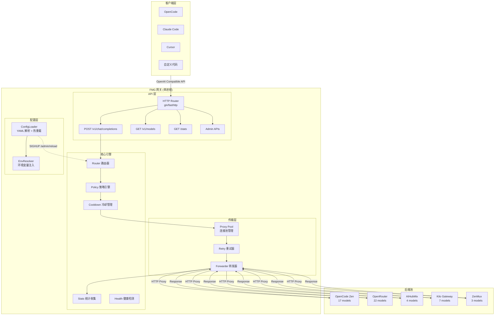
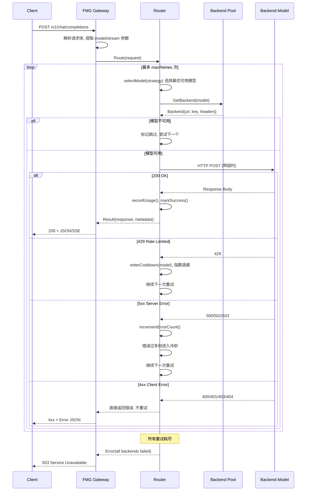

# Free Model Gateway (FMG) — 产品需求与技术架构文档

> 归档日期: 2026-06-02 | 版本: v1.0.0 | 目标端口: **10086**

---

## 文档元信息

| 项目 | 内容 |
|------|------|
| 项目名称 | Free Model Gateway（简称 FMG） |
| 版本 | v1.0.0 |
| 语言 | Go 1.22+ |
| 文档日期 | 2026-06-02 |
| 目标读者 | AI 编程助手（Claude Code / Cursor Agent）作为执行者 |
| 交付物 | 单二进制可执行文件 + 配置文件 |

---

## 一、产品概述

### 1.1 一句话定位

一个自托管的 AI 模型智能网关服务，统一代理多个免费模型 Provider，对外暴露标准 OpenAI 兼容 API，内部实现自动路由、故障转移、配额轮转和健康监测。

### 1.2 核心问题

当前各平台（OpenCode Zen、OpenRouter、AIHubMix、Kilo Gateway、ZenMux）分散提供免费 AI 模型，存在以下痛点：

- **入口分散**：每个平台独立的 API Key、Base URL、认证方式
- **配额不确定**：免费模型的限流策略不透明，随时可能触发 429
- **无自动切换**：某个模型挂了或限流了，需要手动切换
- **质量参差**：不同模型能力差异大，需要按场景优选

### 1.3 目标用户与使用场景

| 用户类型 | 使用方式 |
|---------|---------|
| 个人开发者 | 本地运行 `fmg`，OpenCode/Claude Code/Cursor 统一连 `localhost:10086` |
| 小团队 | 部署到内网服务器，团队共享同一个网关实例 |
| 开源社区 | Docker 部署，`docker run fmg` 即用 |

---

## 二、功能需求（FR）

### FR-01：统一 API 代理

网关必须暴露完全兼容 OpenAI Chat Completions API 的端点：

```
POST /v1/chat/completions    # 非流式
POST /v1/chat/completions    # 流式 SSE（stream=true）
GET  /v1/models              # 模型列表
```

客户端请求到达后，网关透明地转发到后端真实模型，对客户端屏蔽后端差异。

**验收标准**：
- 用 `curl` 发送标准 OpenAI 格式请求能得到正确响应
- 流式请求能正确透传 SSE 事件流
- 响应中包含 `metadata` 字段标注实际使用的后端模型

### FR-02：多 Provider 后端池管理

支持配置多个 Provider，每个 Provider 下有多个模型。启动时从配置文件加载全部后端，运行时支持热重载。

**内置支持的 Provider 及其模型**（来自 models.dev free 模型列表）：

| Provider | Base URL | 免费模型数 | 优先级建议 |
|----------|----------|-----------|-----------|
| OpenCode Zen | `https://opencode.ai/zen/v1/chat/completions` | 17 个 | P0（最高） |
| OpenRouter | `https://openrouter.ai/api/v1/chat/completions` | ~22 个 | P1 |
| AIHubMix | `https://aihubmix.com/v1/chat/completions` | 4 个 | P2 |
| Kilo Gateway | `https://api.kilo.ai/api/gateway/` | 7 个 | P3 |
| ZenMux | `https://zenmux.ai/api/v1/chat/completions` | 3 个 | P4 |

**验收标准**：
- 配置文件中新增一个 Provider + 模型，重启后即可使用
- 不需要修改任何代码

### FR-03：智能路由策略

支持以下路由模式，通过配置文件切换：

| 策略 | 说明 | 适用场景 |
|------|------|---------|
| **priority**（默认） | 按优先级从高到低尝试，高优先级的永远先用 | 生产环境推荐 |
| **round-robin** | 在所有可用模型间循环分配，均摊负载 | 多模型同质时 |
| **weighted-rr** | 加权轮询，权重可手动配置 | 精细控制流量比例 |
| **random** | 随机选一个可用模型 | 测试/压测 |

**验收标准**：
- 默认 priority 模式下，P0 模型的请求量 > P1 > P2
- round-robin 模式下，统计显示各模型调用次数基本均衡

### FR-04：自动故障转移（Failover）

当一次请求失败时，自动尝试下一个可用模型：

**失败判定条件**（触发重试）：
- HTTP 429（Rate Limit / Too Many Requests）
- HTTP 500 / 502 / 503 / 504（服务端错误）
- 连接超时（可配置，默认 60s）
- 读取超时（流式场景，默认 120s）

**不触发重试的条件**（直接返回错误给客户端）：
- HTTP 400（Bad Request — 客户端参数问题）
- HTTP 401 / 403（认证失败）
- HTTP 404（模型不存在）

**验收标准**：
- 后端返回 429 时，自动切换到下一个模型，客户端无感知
- 最大重试次数可配置（默认 3 次）
- 重试之间有可配置的间隔（默认 500ms）

### FR-05：模型冷却与自动恢复

当一个模型连续触发 429 或 5xx 错误时，将其标记为"冷却"状态：

- 冷却期内该模型不参与路由选择
- 冷却时长可配置（默认 300 秒 = 5 分钟）
- 连续失败的模型，冷却时间指数递增：300s → 900s → 2700s（最大 1 小时）
- 冷却到期后自动恢复为 Healthy 状态，同时重置错误计数
- 支持通过管理 API 手动恢复

**验收标准**：
- 被冷却的模型在 `/v1/models` 中 status 显示为 `cooldown`
- 冷却结束后自动恢复，无需人工干预
- 日志中有明确的 `[COOLDOWN]` 和 `[RECOVERED]` 标记

### FR-06：用量追踪与统计

记录每次调用的 token 用量，按模型维度聚合。

**验收标准**：
- `/stats` 端点返回完整的统计数据
- 统计数据仅在内存中持有（进程重启后归零），不做持久化

### FR-07：管理 API

| 端点 | 方法 | 说明 |
|------|------|------|
| `/health` | GET | 健康检查 |
| `/stats` | GET | 运行统计 |
| `/v1/models` | GET | 模型列表及状态 |
| `/admin/recover` | POST | 手动恢复冷却中的模型 |
| `/admin/reload` | POST | 热重载配置文件 |
| `/admin/providers` | GET | 查看 Provider 状态 |

### FR-08：配置管理

- 配置文件格式：YAML（`config.yaml`）
- API Key 通过环境变量注入，**严禁写入配置文件**
- 支持配置热重载（发送 SIGHUP 信号或调用 `/admin/reload`）
- 启动时校验配置合法性，非法配置直接报错退出

---

## 三、非功能需求（NFR）

| 编号 | 需求 | 指标 |
|------|------|------|
| NFR-01 | **性能** | 转发延迟增加 < 10ms（不含后端响应时间） |
| NFR-02 | **并发** | 支持 100 并发连接（Go 天然优势） |
| NFR-03 | **内存** | 空载内存 < 30MB |
| NFR-04 | **可靠性** | 单进程运行，无外部依赖（不需要 Redis/数据库） |
| NFR-05 | **部署** | 单二进制文件，`./fmg` 即运行 |
| NFR-06 | **日志** | 结构化 JSON 日志，输出到 stdout |
| NFR-07 | **可观测性** | Prometheus metrics 端点（可选 `/metrics`） |

---

## 四、系统架构

### 4.1 整体架构图



### 4.2 请求处理流程



---

## 五、Go 项目代码架构

### 5.1 目录结构

```
fmg/
├── cmd/
│   └── fmg/
│       └── main.go              # 入口：解析命令行参数，启动服务
│
├── internal/
│   ├── config/
│   │   ├── config.go            # 配置结构体定义
│   │   ├── loader.go            # YAML 加载 & 校验
│   │   └── reload.go            # 热重载逻辑（SIGHUP + API）
│   │
│   ├── model/
│   │   ├── model.go             # BackendModel 结构体 & 方法
│   │   ├── pool.go              # Pool 模型池管理（CRUD & 查询）
│   │   └── status.go            # ModelStatus 类型 & 状态转换
│   │
│   ├── router/
│   │   ├── router.go            # Router 核心结构 & Route() 方法
│   │   ├── strategy.go          # 策略接口 & 各策略实现
│   │   │   ├── priority.go      #   优先级策略
│   │   │   ├── roundrobin.go    #   轮询策略
│   │   │   ├── weighted.go      #   加权轮询
│   │   │   └── random.go        #   随机策略
│   │   └── fallback.go          # 故障转移逻辑
│   │
│   ├── proxy/
│   │   ├── forwarder.go         # HTTP 转发核心（非流式）
│   │   ├── stream.go            # SSE 流式转发
│   │   ├── client.go            # HTTP Client 连接池配置
│   │   └── rewrite.go           # 请求/响应改写（model 替换、metadata 注入）
│   │
│   ├── cooldown/
│   │   ├── manager.go           # 冷却管理器
│   │   ├── timer.go             # 定时恢复调度
│   │   └── policy.go            # 指数退避冷却策略
│   │
│   ├── stats/
│   │   ├── collector.go         # 用量数据收集
│   │   ├── aggregator.go        # 按维度聚合统计
│   │   └── metrics.go           # Prometheus metrics 导出（可选）
│   │
│   ├── handler/
│   │   ├── chat.go              # POST /v1/chat/completions handler
│   │   ├── models.go            # GET /v1/models handler
│   │   ├── health.go            # GET /health handler
│   │   ├── stats_handler.go     # GET /stats handler
│   │   └── admin.go             # Admin API handlers
│   │
│   └── middleware/
│       ├── logging.go           # 请求日志中间件
│       ├── recovery.go          # Panic 恢复中间件
│       ├── cors.go              # CORS 中间件
│       └── metadata.go          # 响应 metadata 注入中间件
│
├── config.example.yaml          # 示例配置文件
├── Makefile                     # 构建/测试/打包命令
├── go.mod
├── go.sum
└── README.md
```

### 5.2 关键模块职责说明

#### `internal/config/` — 配置管理

核心结构体定义（`Config`、`GatewayConfig`、`StrategyConfig`、`LogConfig`、`ProviderConfig`、`ModelConfig`）按文档中的伪码实现。API Key 通过环境变量注入。

#### `internal/model/` — 模型实体与池管理

```go
type Status string
const (
    StatusHealthy   Status = "healthy"
    StatusCooldown  Status = "cooldown"
    StatusExhausted Status = "exhausted"
)

type BackendModel struct {
    // 静态配置
    ProviderID, ProviderName, ModelID, ModelName, BaseURL, APIKey string
    Priority, Weight, ContextWindow, OutputLimit                  int
    ExtraHeaders                                                  map[string]string
    // 运行时状态
    mu             sync.RWMutex
    Status         Status
    CooldownUntil  time.Time
    SuccessCount, ErrorCount, ConsecErrors                        int64
    LastError                                                      string
    LastUsedAt, CreatedAt                                          time.Time
    InputTokens, OutputTokens, TotalRequests                      int64
    LatencyHistory                                                 *RingBuffer
}
```

提供方法：`IsAvailable() / MarkSuccess() / MarkFailure() / EnterCooldown() / Recover() / ToAPIModel()`。

#### `internal/router/` — 路由引擎

```go
type Router struct {
    pool        *model.Pool
    strategy    Strategy
    cooldownMgr *cooldown.Manager
    stats       *stats.Collector
    cfg         config.StrategyConfig
}

type Strategy interface {
    Select(ctx, candidates, req) (*model.BackendModel, error)
    Name() string
}
```

实现 `PriorityStrategy` / `RoundRobinStrategy` / `WeightedRRStrategy` / `RandomStrategy`。

#### `internal/proxy/` — HTTP 转发层

非流式 `Forward(ctx, backend, body) (*Response, error)`；
流式 `ForwardStream(ctx, backend, body, w) error`。

#### `internal/cooldown/` — 冷却管理

`Manager.EnterCooldown(backend, reason)` — 指数退避 300s→600s→... 封顶 maxCooldown；定时器到期自动 Recover。

#### `internal/handler/` — HTTP Handler

`ChatCompletions` / `Models` / `Health` / `Stats` / `Admin`（recover/reload/providers）。

---

## 六、完整配置文件模板

完整配置模板见 `config.example.yaml`（53 个免费模型：OpenCode Zen 17 + OpenRouter 22 + AIHubMix 4 + Kilo Gateway 7 + ZenMux 3）。

---

## 七、API 响应规范

### 7.1 成功响应（非流式）

在原始后端响应基础上注入 `metadata` 字段：

```json
{
  "id": "chatcmpl-fmg-abc123",
  "object": "chat.completion",
  "created": 1717382400,
  "model": "deepseek-v4-flash-free",
  "choices": [{ "index": 0, "message": { "role": "assistant", "content": "..." }, "finish_reason": "stop" }],
  "usage": { "prompt_tokens": 150, "completion_tokens": 80, "total_tokens": 230 },
  "metadata": {
    "gateway": "FreeModelGateway",
    "version": "1.0.0",
    "actual_provider": "OpenCode Zen",
    "actual_model_id": "deepseek-v4-flash-free",
    "actual_model_name": "DeepSeek V4 Flash Free",
    "fallback_count": 0,
    "fallback_chain": [],
    "route_strategy": "priority",
    "latency_ms": 2340
  }
}
```

### 7.2 错误响应

```json
{
  "error": {
    "message": "all 3 backends failed after retries",
    "type": "gateway_error",
    "code": "no_available_backend",
    "param": null
  },
  "metadata": {
    "gateway": "FreeModelGateway",
    "tried_models": ["OpenCode Zen/deepseek-v4-flash-free", "..."],
    "retries": 3,
    "available_models_count": 38,
    "healthy_models_count": 35,
    "in_cooldown_count": 3
  }
}
```

### 7.3 /v1/models 响应

```json
{
  "object": "list",
  "data": [
    {
      "id": "deepseek-v4-flash-free",
      "object": "model",
      "created": 1717382400,
      "owned_by": "OpenCode Zen",
      "status": "healthy",
      "priority": 10,
      "context_window": 128000,
      "output_limit": 128000,
      "statistics": {
        "total_requests": 1234, "success_count": 1200, "error_count": 34,
        "input_tokens": 567890, "output_tokens": 123456, "avg_latency_ms": 2340
      }
    }
  ]
}
```

---

## 八、Makefile 与构建规范

提供 `build / build-linux / build-darwin / build-windows / build-all / run / test / test-coverage / lint / clean / docker / docker-run / dist / package / install / uninstall / init / dev / check` 目标。多阶段 Docker 构建支持。

---

## 九、命令行接口设计

```
$ ./fmg --help

Free Model Gateway (FMG) v1.0.0
A unified AI model gateway with intelligent routing and failover.

Usage:
  fmg [flags]

Flags:
  -c, --config string       配置文件路径 (default "config.yaml")
  -p, --port int            监听端口 (default 10086)
  -h, --host string         监听地址 (default "0.0.0.0")
  -l, --log-level string    日志等级: debug|info|warn|error (default "info")
  -v, --version             打印版本信息
      --validate-config     仅校验配置文件，不启动服务
      --list-models         列出所有已配置的模型并退出
```

---

## 十、依赖清单（go.mod）

| 包 | 用途 | 是否必需 |
|----|------|---------|
| `github.com/gin-gonic/gin` | HTTP 框架 | 是 |
| `github.com/gin-contrib/cors` | CORS 中间件 | 是 |
| `gopkg.in/yaml.v3` | YAML 配置解析 | 是 |
| `github.com/sirupsen/logrus` 或 `go.uber.org/zap` | 结构化日志 | 是 |
| `github.com/prometheus/client_golang` | Metrics 导出（可选） | 否 |

**原则：依赖尽可能少，保持二进制体积小。**

---

## 十一、开发里程碑（Milestones）

| 阶段 | 内容 | 交付物 |
|------|------|--------|
| **M0** | 项目脚手架 + 配置加载 + 模型池初始化 | 能 `./fmg --list-models` 列出所有模型 |
| **M1** | HTTP 服务 + 非流式单模型转发 | 能 `curl` 代理一个后端的请求 |
| **M2** | 路由引擎（priority 策略）+ 故障转移 | 自动在多个模型间切换 |
| **M3** | 冷却管理 + 自动恢复 | 429 后自动冷却+恢复 |
| **M4** | 流式 SSE 转发 | `stream:true` 正常工作 |
| **M5** | 其余 3 种路由策略 + 管理 API | 功能完整 |
| **M6** | 统计 + 日志 + Prometheus | 可观测性 |
| **M7** | 测试覆盖 + 文档 + Docker + CI | 生产就绪 |

---

## 十二、接入指南

### 启动网关

```bash
export OPENCODE_API_KEY="sk-xxx"
export OPENROUTER_API_KEY="sk-or-xxx"
export AIHUBMIX_API_KEY="your-key"
export KILO_API_KEY="your-key"
export ZENMUX_API_KEY="your-key"

./fmg -c config.yaml
# [INFO] FreeModelGateway v1.0.0 starting...
# [INFO] Loaded 5 providers, 53 models
# [INFO] Listening on :10086
```

### OpenCode 接入

```jsonc
{
  "$schema": "https://opencode.ai/config.json",
  "provider": {
    "fmg": {
      "npm": "@ai-sdk/openai-compatible",
      "name": "Free Model Gateway",
      "options": {
        "baseURL": "http://localhost:10086/v1",
        "apiKey": "fmg-local"
      },
      "models": {
        "auto": { "name": "Auto (智能路由)" }
      }
    }
  }
}
```

### Claude Code 接入

```bash
export ANTHROPIC_BASE_URL="http://localhost:10086"
export ANTHROPIC_API_KEY="fmg-local"
# 或
export OPENAI_BASE_URL="http://localhost:10086/v1"
export OPENAI_API_KEY="fmg-local"
```

### Cursor 接入

Settings → Models → OpenAI API Key: `fmg-local`  
Settings → Models → OpenAI Base URL: `http://localhost:10086/v1`

---

## 十三、运行与分发方案

| 方案 | 适用场景 |
|------|---------|
| **A. 一键启动脚本** | 开发者日常使用：`./start.sh` |
| **B. macOS .app / .command** | Mac 用户双击启动 |
| **C. Windows .bat** | Windows 用户双击启动 |
| **D. 系统服务** | 服务器/常驻后台（launchd / systemd） |
| **E. 全平台分发包** | `build.sh` 一键编译 linux/darwin/windows |

**用户最终操作只有 3 步**：

```bash
# 1. 填 Key
cp .env.example .env && vim .env

# 2. 启动
./start.sh                # Linux/macOS
# 或双击 启动网关.bat      # Windows
# 或双击 启动网关.command   # macOS

# 3. 使用
# 浏览器自动打开 http://localhost:10086/health
```

---

## 十四、变更记录

| 版本 | 日期 | 变更 |
|------|------|------|
| v1.0.0 | 2026-06-02 | 初始版本，5 Providers / 53 Models / 端口 10086 |
